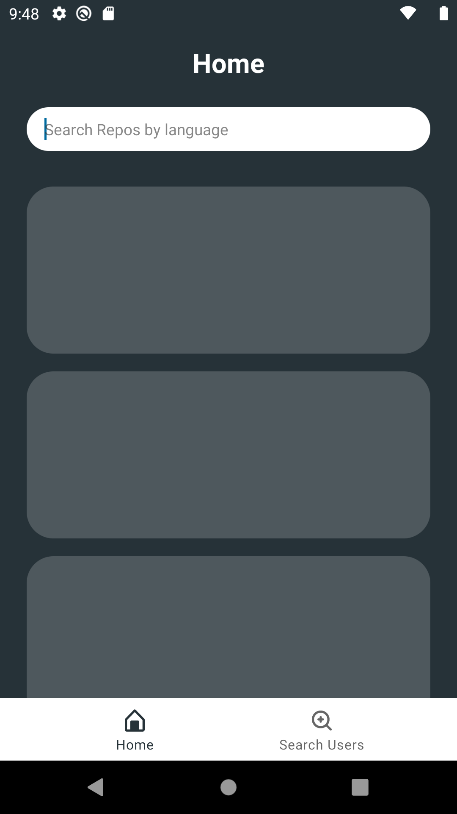
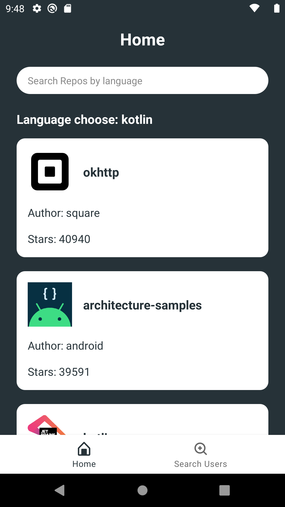
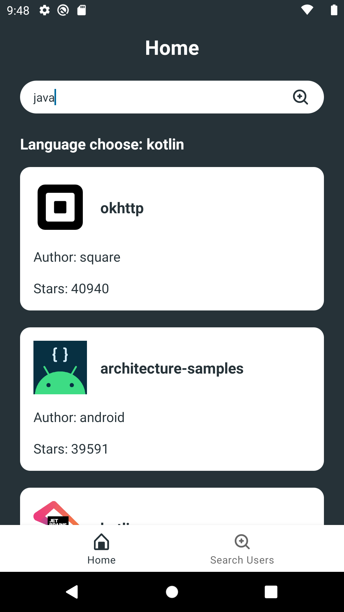
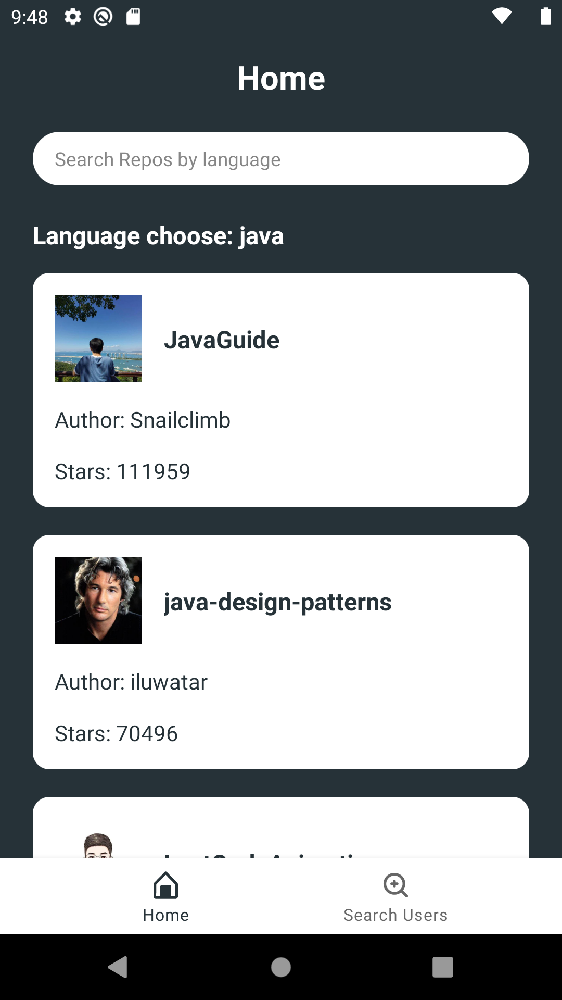
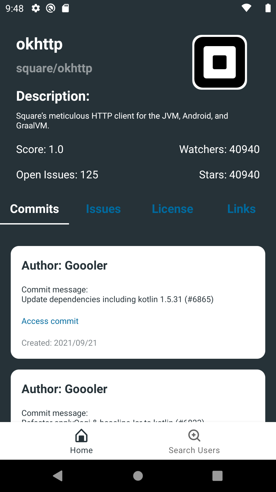
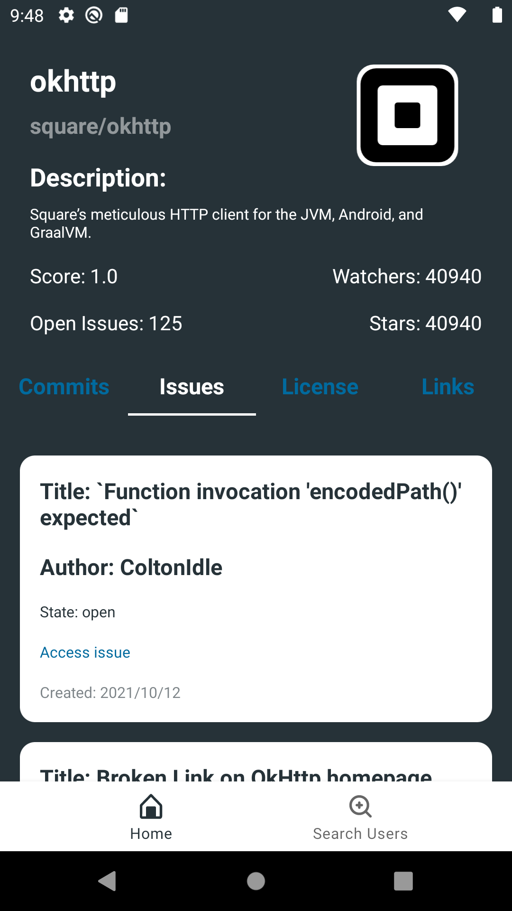
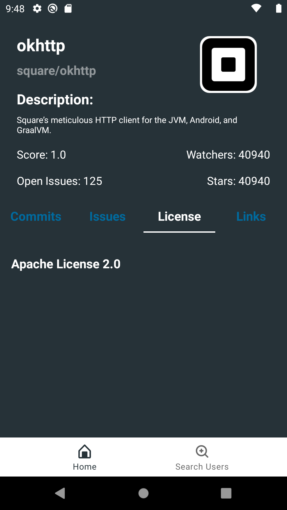
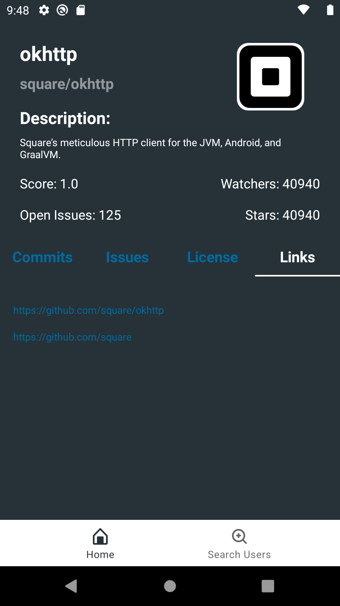
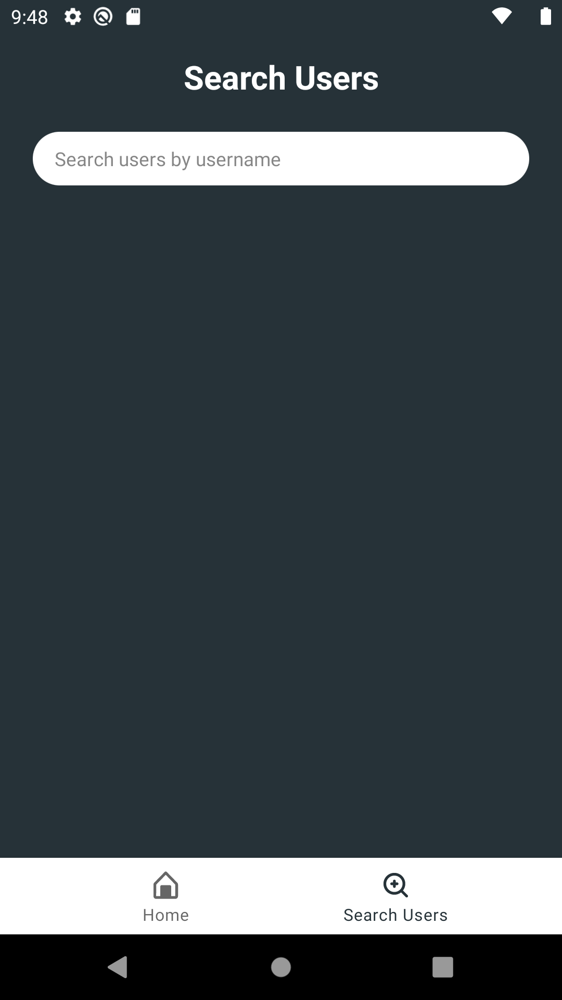
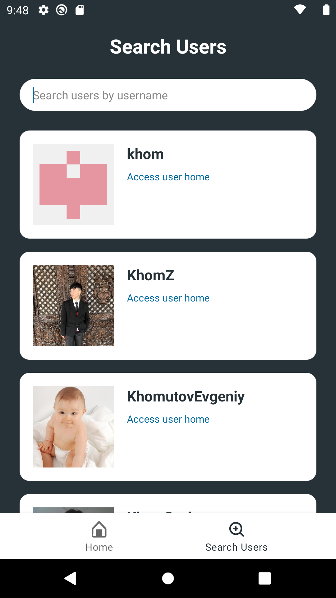

# The-Github-API

Using Github API to created a app.

# Roadmap
- [x] Load Only Repositories using Kotlin
- [x] Search Repositories by language
- [x] Search Repositories Pagination
  - [x] Using Paging3 
- [x] Repository Detail
  - [x] Load Commits with Paging3
  - [x] Load Issues with Paging3
  - [x] License
  - [x] Links
- [x] Search User
- [x] Search Pagination
  - [x] Using Paging3
- [x] UI Test
  - [x] Home
  - [x] Search User
  - [x] Detail
    - [x] Issues
    - [x] Commits
    - [x] License
    - [x] Links
- [x] Config Jacoco
- [x] Run UI Tests on CI

# Using
- Koin
- Espresso
- Coroutines
- Paging3
- ViewModel
- LiveData
- Flow
- Kotlin
- Mockk
- Navigation
- Retrofit
- Coil

# App

  <kbd>
    
  </kbd>
  <kbd>
    
  </kbd>
  <kbd>
    
  </kbd>
  <kbd>
    
  </kbd>
  <kbd>
    
  </kbd>
  <kbd>
    
  </kbd>
  <kbd>
    
  </kbd>
  <kbd>
    
  </kbd>
  <kbd>
    
  </kbd>
  <kbd>
    
  </kbd>

